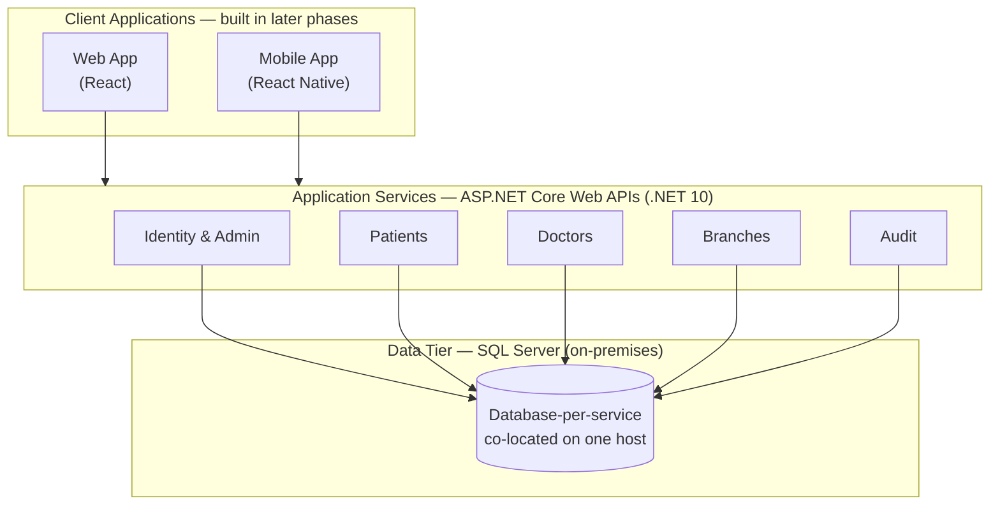
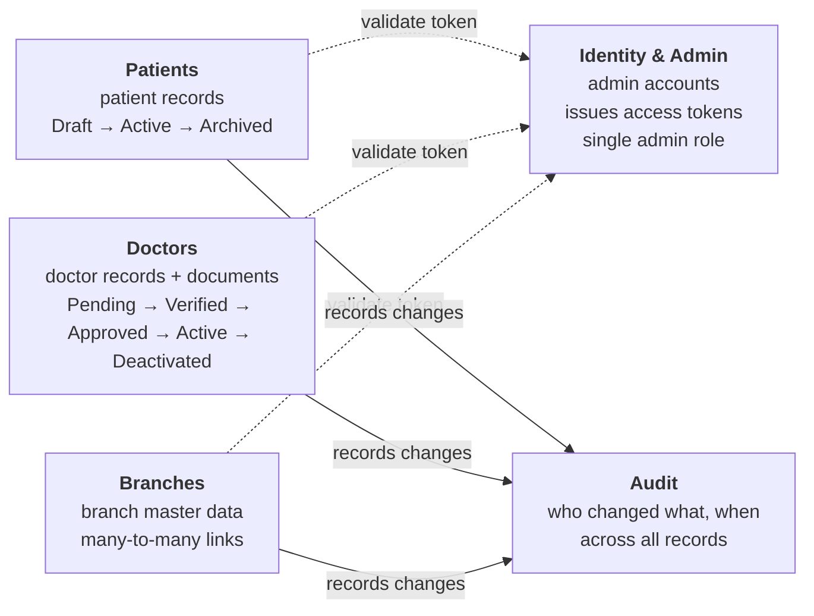
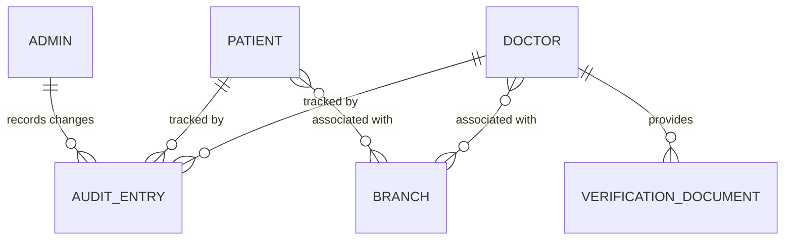
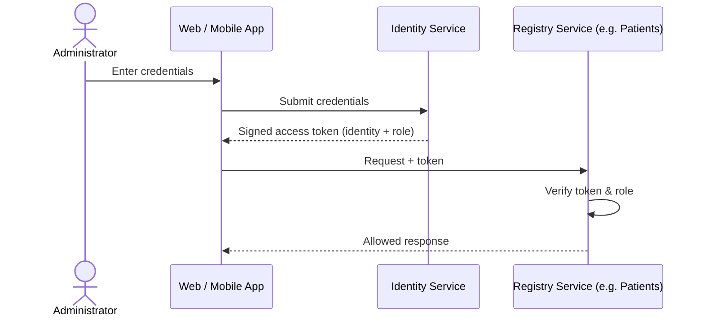
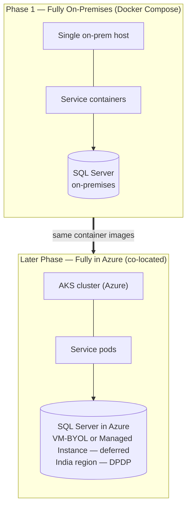
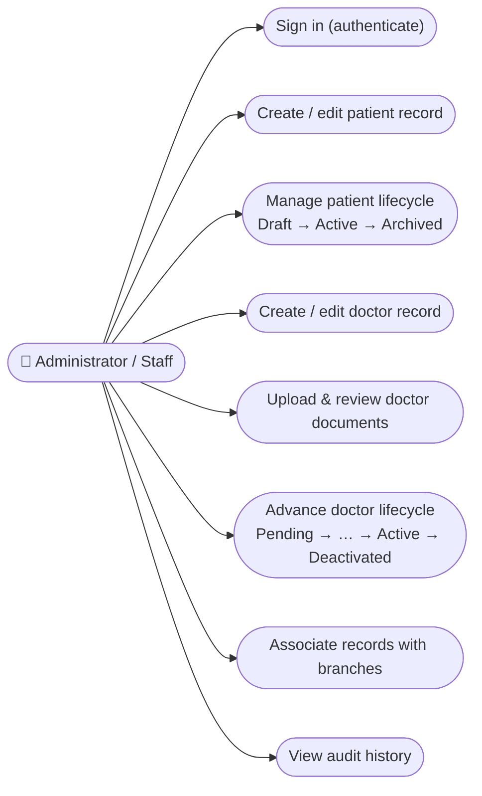

# High-Level Technical Specification — Nexus HA

**Hospital Patient & Doctor Registry Platform**

> A plain-language explanation of *how* the Nexus HA platform will be built, prepared for business owners. This document describes technical direction and trade-offs at a high level. It deliberately avoids low-level engineering detail (API contracts, database columns, message formats, and the like).

| | |
|---|---|
| **Document Title** | High-Level Technical Specification — Nexus HA |
| **Prepared For** | Business Owners |
| **Prepared By** | Solution Architect |
| **References** | Business Requirements Document — Patient & Doctor Registry (v0.1) |
| **Status** | Draft — For Review |
| **Version** | 0.1 |
| **Date** | 27 May 2026 |

---

## Document Control

### Revision History

| Version | Date | Author | Summary of Changes |
|---|---|---|---|
| 0.1 | 27 May 2026 | Solution Architect | Initial high-level technical specification derived from the approved BRD and stakeholder architecture decisions. |

### Approvals

| Name / Role | Signature | Date |
|---|---|---|
| Business Owner | | |
| Product Owner | | |
| Solution Architect | | |
| Sponsor | | |

---

## Table of Contents

1. Introduction & Purpose
2. Solution Overview — Architecture at a Glance
3. Technology Stack
4. Architecture Style — Microservices
5. Data Architecture
6. Authentication & Access (High-Level)
7. Deployment Approach
8. Packaging & Distribution
9. Use Cases — System Interactions
10. Phased Delivery Roadmap
11. Known Limitations, Trade-offs & Risks
12. Assumptions & Constraints
13. Glossary

---

## 1. Introduction & Purpose

This document explains, in business terms, **how the Nexus HA platform will be built**. It is the technical companion to the approved Business Requirements Document (BRD), which defined *what* Nexus HA must do: serve as an administrative registry for enrolling and managing registered patients and registered doctors across a single hospital with multiple branches.

**Who this is for.** This specification is written for **business owners and sponsors** — the people validating the build approach and funding it. It is not an engineering design document. Wherever a technical term is unavoidable, it is explained in plain language, and a full Glossary appears in Section 13.

**How to read it.** Sections 3 to 8 each cover one major technical decision using the same simple shape: *what we decided*, *what it means in plain terms*, *why it fits Nexus HA*, and *the trade-offs we are knowingly accepting*. Section 11 then gathers every trade-off into a single risk table so nothing is hidden. Diagrams throughout are written in Mermaid and will render automatically in any Markdown viewer that supports it.

**Relationship to the BRD.** Every technical choice here traces back to a business reality stated in the BRD — a single hospital, medium data volume (tens of thousands of records), administrator-only access, no external integrations, no notifications, and mandatory compliance with India's Digital Personal Data Protection (DPDP) Act.

---

## 2. Solution Overview — Architecture at a Glance

Nexus HA is built as a set of **independent back-end services** (an "API-first" approach, exactly as the BRD requires). Web and mobile applications are *consumers* of those services and are built in later phases. All information is stored in **SQL Server**, reusing the hospital's existing database licenses.

### Decision summary

| Dimension | Decision | Why, in one line |
|---|---|---|
| **Architecture style** | Microservices | Supports adding platform capabilities phase by phase. |
| **Technology stack** | .NET 10 / ASP.NET Core Web API; React (web) + React Native (mobile) | Coherent, well-supported enterprise stack; API-first per the BRD. |
| **Database** | SQL Server (on-premises), database-per-service on a shared host | Reuses existing licenses; keeps each service's data isolated. |
| **Deployment** | Phase 1 fully on-premises (Docker Compose) → later, fully in Azure (AKS) | Start simple; adopt full orchestration when scale justifies it. |
| **Packaging** | Docker containers | The same packaged units move unchanged from on-premises to the cloud. |
| **Authentication** | Self-hosted identity, token-based; administrators only | Full control, works on-premises, matches admin-only access. |

---

## 3. Technology Stack

**What we decided.** The back-end services are built with **C# on .NET 10** (the current long-term-support release) using **ASP.NET Core Web APIs**, with **no server-side page rendering**. The user-facing applications are a **React** web app and a **React Native** mobile app, both built later and both simply calling the same APIs.

**In plain terms.** We chose one well-established technology family for the engine room of the platform, and a matching modern toolkit for the screens people will eventually use. The "no server-side page rendering" point simply means the platform's job is to serve data and rules through APIs; drawing the screens is the job of the web and mobile apps.

**Why it fits Nexus HA.** The BRD explicitly asks for an API-first build with web and mobile front-ends added later — this stack delivers exactly that. A single language family keeps the team focused, .NET has first-class support for SQL Server, and React and React Native share concepts so web and mobile skills reinforce each other.

**Trade-offs accepted.** This is a mainstream, low-risk choice; there are no significant downsides to flag for this system.

---

## 4. Architecture Style — Microservices

**What we decided.** Nexus HA is built as **microservices** — several small, independently deployable services rather than one large application.

**In plain terms.** Instead of building the whole platform as a single block, we build it as a set of separate, self-contained services — for example, a service for patients, one for doctors, one for branches, one for the identity/login concern, and one for the audit history. Each can be updated and deployed on its own.

**Why it fits Nexus HA.** The business intent is to deliver only a **subset of capabilities in Phase 1 and add more in later phases**. Separating the platform into services lets each new capability be added and released with less risk of disturbing what already works.

**Trade-offs accepted.** Microservices are powerful but not free, and for a medium-scale, single-hospital registry they carry real overhead that the business should see plainly:

- They add operational complexity from day one — more moving parts to deploy, monitor, and keep talking to one another — before any feature ships.
- Rules that naturally span the whole system, such as the BRD's *phone-number + role uniqueness* check and the *full audit trail*, are simpler in a single application and require more care when the system is split apart.
- The biggest risk is **committing to the wrong service boundaries early**, while the full set of future capabilities is still unknown; re-drawing those boundaries later, across running services, is more costly than reorganising code inside one application.

These costs are **knowingly accepted** in exchange for the phased-growth benefit. They are mitigated by keeping the Phase 1 services deliberately coarse and revisiting the boundaries before they harden. (A modular single application was considered as the lower-overhead alternative and consciously set aside.)

---

## 5. Data Architecture

**What we decided.** All data is stored in **Microsoft SQL Server**, reusing the hospital's **existing on-premises licenses**. Each service has its **own database**, and in the early phases those databases are **co-located on a single SQL Server host**. The high-level shape of the data is shown below — entities and their relationships only, with no field-level detail (that belongs to the later design phase).

*Note: this is a **logical** view. Physically, these entities live in separate per-service databases; the diagram shows how they relate conceptually, not how they are stored together.*

**In plain terms.** Every service keeps its own records in its own database, which keeps services independent. To start, all those databases sit on one database server we already own and are licensed for.

**Why it fits Nexus HA.** Reusing existing SQL Server licenses avoids new spend, and giving each service its own database is the correct, clean pattern for a microservices design.

**Trade-offs accepted, and the future path.**

- **Shared-host limitation (known).** Placing every service's database on a single host means that host is a **single point of failure** — if it goes down, all services lose their data at once — and services can contend for the same resources. For the current data volume this is operationally acceptable, but it is recorded here as a known limitation, with a clear upgrade path to separate database instances and high-availability configurations when scale or availability demands it.
- **Later move to Azure (deferred decision).** In a later phase, when compute moves to the cloud, the database moves with it so the two stay together (see Section 7). The specific Azure hosting option is **deliberately left open** for now, with the two candidates and their trade-offs documented:

  | Option | What it means | Trade-off |
  |---|---|---|
  | **Azure VM running SQL Server (bring-your-own-license)** | A "lift and shift" of the current setup onto a cloud server we manage. | Maximum control and straightforward license reuse, but we keep responsibility for patching, backups, and high availability. |
  | **Azure SQL Managed Instance (with Azure Hybrid Benefit)** | A managed database service where Microsoft handles most upkeep. | Much less operational burden, but it is a managed-service model with some feature and cost differences, and license eligibility for Hybrid Benefit must be confirmed. |

- **DPDP data residency (mandated).** Today, all personal data stays on-premises, which is the strongest possible position for data control. The moment patient and doctor personal data moves to a cloud-hosted database, a **data-residency and data-sovereignty obligation** under India's DPDP Act comes into play. It is therefore **mandated** that, when the database moves to the cloud, it resides in an **India Azure region**, with appropriate data-processor safeguards and access controls in place. This is a firm requirement, not an option.

---

## 6. Authentication & Access (High-Level)

**Scope.** Per the BRD, **only administrators/staff use Nexus HA** — patients and doctors never log in. Authentication therefore applies solely to administrator accounts.

**What we decided.** Identity is handled by a **self-hosted identity service inside the platform** using **token-based authentication** (the standard OpenID Connect / OAuth 2.0 approach with signed tokens). **Multi-factor authentication is not required at this stage.**

**In plain terms — how a login works.** When an administrator signs in, an identity component checks their credentials and hands back a **signed, time-limited digital pass** that carries their identity and role. Every request the app makes afterwards presents that pass, and each service checks it before doing anything. The pass expires and is quietly renewed.

**Why it fits Nexus HA.** A self-hosted identity service keeps full control in-house and works cleanly on-premises, matching the early-phase deployment. Token-based authentication suits a microservices design particularly well, because each service can verify the pass on its own without checking back with a central session store. The BRD's "single all-powerful admin role" is simply carried as a *role* inside the token, and the model can grow to finer-grained roles later without rework.

**Trade-off accepted.** Operating without multi-factor authentication for privileged access to personal healthcare data raises the risk of account compromise. This is accepted for the current phase and flagged for revisiting before production scale-up (see Section 11).

---

## 7. Deployment Approach

**What we decided.** In the **early phases, everything runs on-premises**: the service containers and the SQL Server database sit together in the hospital's own environment, coordinated by **Docker Compose**. In a **later phase, the platform moves fully into Azure** — the services into **Azure Kubernetes Service (AKS)** and the database into Azure alongside them — so that compute and data remain co-located.

**In plain terms.** We begin with a simple setup entirely inside the hospital, then graduate to a self-managing cloud platform once the workload justifies it — and crucially, the database travels with the services so they always live close together.

**Why it fits Nexus HA.** Starting on-premises keeps the early phases simple and avoids cloud cost and complexity before they are needed. Moving compute and data to the cloud *together* avoids the performance penalty that would come from cloud services repeatedly reaching back to an on-premises database.

**Trade-offs accepted.**

- **The early posture is not highly available.** Docker Compose runs on a single host with no automatic recovery, no failover, and no rolling upgrades. Until the move to AKS, the platform is a single point of failure. This is acceptable for pilot and early phases and is resolved by AKS, which adds self-healing, rolling upgrades, and scaling.
- **No steady-state split between cloud and on-premises.** Because the database moves to the cloud at the same time as the services, the slow "cloud-app-talking-to-on-prem-database" arrangement is never a permanent state — at most a brief transition.

---

## 8. Packaging & Distribution

**What we decided.** Each service is packaged as a **Docker container** and distributed as a container **image**.

**In plain terms.** A container is a sealed box that holds a service together with everything it needs to run, so it behaves the same wherever it is placed. We build each service once into such a box.

**Why it fits Nexus HA.** Containers are the natural unit for both Docker Compose (early phases) and AKS (later). Because the **same images carry forward unchanged**, the move from on-premises to the cloud becomes largely a configuration change rather than a rebuild — which de-risks that future transition considerably.

**Trade-offs accepted.** None of note; containerisation is the industry-standard packaging approach and underpins the smooth Compose-to-AKS path described above.

---

## 9. Use Cases — System Interactions

The diagram below shows the main things an administrator does with Nexus HA. Note that **patients and doctors are not actors** here — they do not interact with the system directly, consistent with the BRD.

---

## 10. Phased Delivery Roadmap

| | **Phase 1 (current)** | **Later phases** |
|---|---|---|
| **Capabilities** | A subset of registry capabilities | Additional capabilities added incrementally |
| **Architecture** | Microservices (coarse-grained set) | More services as capabilities grow |
| **Deployment** | Fully on-premises, Docker Compose | Fully in Azure, AKS orchestration |
| **Database** | SQL Server on-premises | SQL Server in Azure (option deferred), India region |
| **Identity** | Self-hosted, token-based, no MFA | Revisit MFA; option to federate with Azure Entra ID |

---

## 11. Known Limitations, Trade-offs & Risks

Every consequence discussed during the architecture decisions is consolidated here so that nothing is hidden from sign-off.

| # | Area | Trade-off / Consequence | Status & Mitigation |
|---|---|---|---|
| 1 | Architecture | Microservices add operational overhead and risk early commitment to the wrong service boundaries on a medium-scale system. | **Accepted** — justified by phased growth. Keep Phase-1 services coarse; revisit boundaries before they harden. |
| 2 | Data tier (shared host) | All service databases on one host = single point of failure and resource contention. | **Accepted** for current scale. Path: separate instances / high-availability configuration when needed. |
| 3 | Interim availability | Docker Compose on a single host has no auto-recovery, failover, or rolling upgrades. | **Accepted** for early phases. Resolved on move to AKS. |
| 4 | Cloud migration performance | Cloud services reaching an on-premises database would add latency. | **Avoided by design** — database moves to the cloud with the services; hybrid only as a brief transition. |
| 5 | DPDP residency (cloud) | Moving personal data to the cloud creates data-residency / sovereignty obligations. | **Mandated** — India Azure region + data-processor safeguards. |
| 6 | Later database hosting | Azure VM (BYOL) vs Azure SQL Managed Instance not yet chosen. | **Deferred** — both documented (Section 5); decide at the Azure-migration phase. |
| 7 | Authentication — no MFA | Privileged admin access to personal healthcare data without a second factor raises account-compromise risk. | **Accepted** for now; recommend introducing MFA before production scale-up. |

---

## 12. Assumptions & Constraints

- The hospital already owns and is licensed for SQL Server (on-premises), and this will be reused.
- Only administrators/staff interact with the platform; patients and doctors do not log in (per the BRD).
- The platform is standalone in this release — no integrations with external or existing hospital systems.
- Web and mobile front-ends are built in later phases and consume the same APIs.
- Activation of a doctor depends on confirmations from departments outside the platform's control (HR / Personnel / Logistics); the platform records state but does not orchestrate those processes (per the BRD).
- Expected data volume is medium — on the order of tens of thousands of records across all branches.

---

## 13. Glossary

| Term | Plain-language meaning |
|---|---|
| **API** | A defined way for one piece of software to request data or actions from another. |
| **API-first** | Building the data-and-rules services first, with screens added later as consumers. |
| **Microservices** | Building a system as several small, independently deployable services rather than one large block. |
| **Monolith** | The alternative: one large application deployed as a single unit. |
| **Container** | A sealed package holding a service plus everything it needs, so it runs the same everywhere. |
| **Image** | The built, shippable form of a container. |
| **Docker Compose** | A simple tool to run a set of containers together on one host. |
| **Kubernetes / AKS** | A platform that runs many containers across machines with self-healing and scaling; AKS is Microsoft Azure's managed version. |
| **Database-per-service** | Each service owns its own database, keeping services independent. |
| **On-premises** | Running on the hospital's own servers rather than in the cloud. |
| **BYOL (Bring Your Own License)** | Reusing a license you already own when moving software to the cloud. |
| **Azure SQL Managed Instance** | A managed cloud database service that is highly compatible with SQL Server. |
| **Azure Hybrid Benefit** | An Azure programme that lets eligible existing licenses reduce cloud cost. |
| **OAuth 2.0 / OpenID Connect** | Industry-standard methods for secure sign-in and access tokens. |
| **Token (JWT)** | A signed, time-limited digital pass proving who a user is and what role they hold. |
| **MFA (Multi-Factor Authentication)** | Requiring a second proof of identity (e.g., a code) in addition to a password. |
| **Single point of failure** | A component whose failure brings down the whole system. |
| **Audit trail** | A tamper-evident record of who changed what, and when. |
| **DPDP Act** | India's Digital Personal Data Protection Act, governing handling of personal data. |

---

*Confidential — Draft v0.1 — Nexus HA High-Level Technical Specification*
