<div align="center">
  <img src="data:image/jpeg;base64,/9j/4AAQSkZJRgABAQAAAQABAAD/4gHYSUNDX1BST0ZJTEUAAQEAAAHIAAAAAAQwAABtbnRyUkdCIFhZWiAH4AABAAEAAAAAAABhY3NwAAAAAAAAAAAAAAAAAAAAAAAAAAAAAAAAAAAAAQAA9tYAAQAAAADTLQAAAAAAAAAAAAAAAAAAAAAAAAAAAAAAAAAAAAAAAAAAAAAAAAAAAAAAAAAAAAAAAAAAAAlkZXNjAAAA8AAAACRyWFlaAAABFAAAABRnWFlaAAABKAAAABRiWFlaAAABPAAAABR3dHB0AAABUAAAABRyVFJDAAABZAAAAChnVFJDAAABZAAAAChiVFJDAAABZAAAAChjcHJ0AAABjAAAADxtbHVjAAAAAAAAAAEAAAAMZW5VUwAAAAgAAAAcAHMAUgBHAEJYWVogAAAAAAAAb6IAADj1AAADkFhZWiAAAAAAAABimQAAt4UAABjaWFlaIAAAAAAAACSgAAAPhAAAts9YWVogAAAAAAAA9tYAAQAAAADTLXBhcmEAAAAAAAQAAAACZmYAAPKnAAANWQAAE9AAAApbAAAAAAAAAABtbHVjAAAAAAAAAAEAAAAMZW5VUwAAACAAAAAcAEcAbwBvAGcAbABlACAASQBuAGMALgAgADIAMAAxADb/2wBDAAUDBAQEAwUEBAQFBQUGBwwIBwcHBw8LCwkMEQ8SEhEPERETFhwXExQaFRERGCEYGh0dHx8fExciJCIeJBweHx7/2wBDAQUFBQcGBw4ICA4eFBEUHh4eHh4eHh4eHh4eHh4eHh4eHh4eHh4eHh4eHh4eHh4eHh4eHh4eHh4eHh4eHh4eHh7/wAARCADTAO8DASIAAhEBAxEB/8QAHAABAAIDAQEBAAAAAAAAAAAAAAUHAgMIAQQG/8QAQxAAAQIDAQsFDQgDAQAAAAAAAAIDAQQFBhESFBczNVRyc5KyBxMWUZMIFSIxMjQ2QVJVYnGxISRCQ1NWYcIjJZQm/8QAGwEBAAEFAQAAAAAAAAAAAAAAAAYBAgMEBQf/xAAwEQEAAgECBQEGBAcAAAAAAAAAAQIDBBEFEiExUUEGExQyYZEVInGxMzRCUoGh0f/aAAwDAQACEQMRAD8A7HdXBPj/ABfYZpPgqkf8srt08R96QPQAAAAAAAAAAAAAAAAAAAAAAAAAAAAAAAAAANba4OQvkGwjaDm1ACqZaW27fESKSOqmWltu3xEikD0AAAAAAAAAAAAAAAAAAAAAAAAAAAAAAAAAACNs/m1BJEbZ/NqAFUy0tt2+IkUkdVMtLbdviJFIHoAAAAAAAAAAAAAAAAAAAAAAAAAAAAAAAAAAEbZ/NqCSI2z+bUAKplpbbt8RIpI6qZaW27fESKQPQAAAAAAxVEDIGvnUC/8AkW89fKkTu2A134gsc0G7YDG6Y36CszEG7YDXfo6xfo6xzR5N4bAa79PXA9UsRMT2N4Zg136Os9v0dZXqpzQzBhfp6zxC74K80NgACoAAAAAEbZ/NqCSI2z+bUAKplpbbt8RIpI6qZaW27fESKQPQAAAAA1TGQXqxNpqfyK9WJZf5ZUnsoWYnJvnl/eXvKj+ZE14XN6S92kTGa88XrRNZ5RlzZOeZmZ+7mTPVuwyb0l7tIkzYiZmF2pp6FzDy0qcilV8qPsxIAmrC+mFM2seGJn0WW86ikbz3j1nyux2nmhdhQXKbOTbdtZ9tEy8hF9DwUuRueSX+c88qXp5UNZP0gT7i9pjFG3ll10zFI2QXfCf02Z7SI74T+mzPaRPmBHfeX8uVz28vp74T+mzPaROjZmQl6tQcAmr9bTzEEq8K4rxeO71nNCjqKm5uY2Sfodvg97Wm28t/RdYtu5K5W7JWlsTV7sKlUHqU+qODzPPq+z4VdUT8N33q/vad7ZR3LaKjSFdo71MqcuiYl3k3qkq+vzOReVnk9n7C1f8AG9Sn1fdpnq+FXVEk2LJzdJR/i3DsmntOTFvy/rP/AF+U771f3tO9sovTuSZybmpu0GFTLz3NpYuc45FVzy+soAvnuPfPLR6rH9y/LEcrU4NktbWViZ6Oi0npjDxGRpJ8AAAAABG2fzagkiNs/m1ACqZaW27fESKSOqmWltu3xEikD0AAAAANb2RXqxNhqfycflEsv2J7Of5rzx/WiayWmLPV5by/9VO+VHyWzDo9Xvc072cTyvJpc3PP5J+0+Z+jmWpaZ32RhM2G9L6ZtI8MTR0ervuad7OJL2OotWlrU096Zp0yy02qKlKUm5CHgxM2j02euppaaTEbx6T5XYqW5o6LfOeeVL08qGsn6QOhCjeUWz1dnLYT8zK0admZdSoXqm27sFeCTzitLXxRyx6sutrNqRtHq/DgmOitpf27UOxie9FrS/t6odjEj3uMnj/UuZ7q/hCnUVNzcxsk/Q526K2l9w1D1flnRdPTFuTZQvy0twunb4RjvSbc0N/RUtG+8PpvSLtDRZCvUh6mVSXRMSryb1SVfWHVElTxR24nZvWrFo2lxfyr8ntTsNV4J8N6lOqjg0x/Hsq6oli9x755aTVY/uXtaOh0+0FHfplTl0PS7yb1SVfX5lecjFg56wtqbRsrjz1PmUsqlH/WqEL66mP8wM85N6bSjtOFzptdXJjj8srYSemDZmYEjgAAVAAAI2z+bUEkRtn82oAVTLS23b4iRSR1Uy0tt2+IkUgegAAAABioyNb2SLbTtG49F3+CoZi29oUPLRhDHgqj+WY9O7Q6Qz2ZHp9o9JWduv2a86ikTsuAFPqtzaHSGOzJKzFra1Ua7JST7jPNPKjBXg/DEvxe0Oly3ikb9VYz1laBiZFP25txaGk2pnKfJOMIabuXt83d/CdjUammCsWuuy5YxRvK3jIoTGVanSJXsRjKtTpDPZml+LYI9JYPjsf1XyZFCYybU6Qx2ReUitbkmytflxTCKja02spqN+X0ZsWauTs+oAxVE22ZkeHzT85LyUouamnENMNpipxxSrkEwgfg+TLlDbtvaOusyDf+qkOaTLuKTGCnIxu3VfL7CsRMsN89KXikz1nssYHiT0ozAAAAAARtn82oJIjbP5tQAqmWltu3xEikjqplpbbt8RIpA9AAAAADU/kV6sTaan8ivViW3+WVJ7Of5rzxetE1mya88XrRNZ5Hk+af8/u5c9wmbDel9M2keGJDE1YX0wpm1jwRM+h/mafrH7rsfeI+q7jnnlS9PKhrJ+kDoY555UvTyoayfpA9A4x/Cr+rLr/kh+ZABHHKeKOoqbm5jZJ+hy6o6ipubmNkn6Hc4L/U6Oh7S+w+WoTTElKLmZpxDTDaYxccWq5BMDGdmZeVlFzUy4hlhtMYrUpVyCYQOV+W3lRftbNrotIcWzQ2lXqvUqYjD1x+EkNKTaei7X6+mkpvPf0hjy28qL9sJxdIpDi2aGyr2r2M1Hrj8J+q7kDzy0eqx/coYvnuPvPLR6rH9zZvEVptCLcO1OTUa+t7z1dFJ8RkYw8RkaacQAAKgAAEbZ/NqCSI2z+bUAKplpbbt8RIpI6qZaW27fESKQPQAAAAA0zMbjK9WJuMVFt43rMKS56mlffHtaJhfF8KotJXD7adLdnAd46T7vluygQu3sxltO/vI+0tT4aZUPfE1YZX/r6ZtI8MS3O8dJ93SvZwM2qVTWXUPMyTCFp8lSW4XYGTT+zeTFlrkm8dJ37SurpprMTu+5Rz3ypK/wDeVDWTwwOhiNmaLSJl1bz9PlnXVeUpTcIxiSbWaX4ikV3XajF72uzmS+bF82dLdHKF7rk+xgOjlC91yfYwOX+D2/uafwFvLmm63+odOImpeTo6JqacQyw2zBS3FKuQTC56zT0coPuqT7KB9k7Iyk5Jrk5qXbel1QvVNqTdTGHVcN/Q6KdNvvO+7Zwae2KJ693KvLZyquWtm10WizHM0NtXlJVcjNRh64/CVfzjf6iN6B3L0Nsn+3KX/wAyR0Nsn+3aX/zJOxXLFY2iHC1HBNRqMnPfJH2lw1zjf6iN6BfPcfK++Wj1WP7l2dDrJ/t2l/8AMk+2k0Wk0mLiqZTpWT525znMtwRfXPFdufMWyxaNl+g4HfTZ4yzeJ2SUPEZHiT0wJKAAAAABG2fzagkiNs/m1ACqZaW27fESKSOqmWltu3xEikD0AAAAAAAAAAAAAAAAAAAAAAAAAAAAAAAAAACNs/m1BJEbZ/NqAFUy0tt2+IkUkdVMtLbdviJFIHoAAAAAAAAAAAAAAAAAAAAAAAAAAAAAAAAAAEbZ/NqCSI2z+bUAKplpbbt8RIpI6qZaW27fESKQPQAAAAAAAAAAAAAAAAAAAAAAAAAAAAAAAAAAI2z+bUEkRtn82oAVWP8AmlduniPs59jSEb0D469J4bJrY9oruY5PnFvX/gAWhhEvpDW/AYRL6Q1vwKrxd6gxd6gFqYRL6Q1vwGES+kNb8Cq8XeoMXeoBamES+kNb8BhEvpDW/AqvF3qDF3qAWphEvpDW/AYRL6Q1vwKrxd6gxd6gFqYRL6Q1vwGES+kNb8Cq8XeoMXeoBamES+kNb8BhEvpDW/AqvF3qDF3qAWphEvpDW/AYRL6Q1vwKrxd6gxd6gFqYRL6Q1vwGES+kNb8Cq8XeoMXeoBamES+kNb8BhEvpDW/AqvF3qDF3qAWphEvpDW/AYRL6Q1vwKrxd6gxd6gFqYRL6Q1vwGES+kNb8Cq8XeoMXeoBamES+kNb8BhEvpDW/AqvF3qDF3qAWphEvpDW/AYRL6Q1vwKrxd6gxd6gFqYRL6Q3vQPjs/m1BX9PsA4xOIX7JY1MlsGkkMeyB9YAAxAAAAAAAAAAAAAAAAAAAAAAAAAAAAAAAAAAGSQAB/9k=" alt="Nexus HA logo" width="130"/>

  <h1>Low-Level Technical Specification — Nexus HA</h1>
  <h3>Hospital Patient &amp; Doctor Registry Platform</h3>
</div>

> The engineer-facing companion to the HLD. It specifies concrete API contracts, the RFC 9457 error structure, the concrete SQL Server schema, the cross-cutting NFRs, the BFF and audit-subsystem designs, and the service dependency model. Diagrams are written in Mermaid and render in any compatible Markdown viewer.

| | |
|---|---|
| **Document Title** | Low-Level Technical Specification — Nexus HA |
| **Prepared For** | Engineering Team / Technical Reviewers |
| **Prepared By** | Solution Architect |
| **References** | HLD — Nexus HA (v0.1); ADR — Nexus HA (v0.1); BRD — Patient & Doctor Registry (v0.1) |
| **Status** | Draft — For Review |
| **Version** | 0.1 |
| **Date** | 27 May 2026 |

---

## Document Control

### Revision History

| Version | Date | Author | Summary of Changes |
|---|---|---|---|
| 0.1 | 27 May 2026 | Solution Architect | Initial low-level technical specification derived from the approved HLD, ADRs, and stakeholder design decisions. |

### Approvals

| Name / Role | Signature | Date |
|---|---|---|
| Solution Architect | | |
| Tech Lead | | |
| Security / Compliance | | |

---

## Table of Contents

1. Introduction & Purpose
2. Architectural Recap
3. Service Catalogue
4. Service Interaction & Dependency Model
5. Modular Service Design
6. API Design Standards
7. Error Handling — RFC 9457 Problem Details
8. API Contracts (per service)
9. Concrete Database Schema
10. Authentication (AuthN)
11. Authorization (AuthZ)
12. Cross-Cutting Non-Functional Requirements
13. BFF Design
14. Audit Subsystem Design
15. Key Workflow Sequences
16. Coding Standards & Conventions
17. Requirements Traceability (BRD ↔ Implementation)
18. Known Limitations, Trade-offs & Risks
19. Assumptions & Open Items
20. Appendices

---

## 1. Introduction & Purpose

This document defines **how Nexus HA is built at the implementation level**. Where the HLD explained the direction in business terms, the LLD gives the engineering team concrete, buildable detail: endpoint shapes, status codes, database tables and columns, token formats, resilience policy values, and observability wiring.

**Scope.** In scope: API contracts and conventions, the standardized error model, the concrete per-service database schema, the cross-cutting NFRs, the BFF, the audit subsystem, and the service dependency model. Out of scope: exhaustive field-by-field enumeration of every endpoint (that lives in the OpenAPI specification generated from code), UI/UX design, and infrastructure provisioning scripts.

**Audience.** Backend engineers, the tech lead, and security/compliance reviewers.

**Conventions.** All examples use `.NET 10` / ASP.NET Core idioms. Timestamps are UTC (`datetime2`, suffixed `Utc`). JSON is `camelCase`. All identifiers are described in §9.

**References.** Business Requirements Document (BRD v0.1), High-Level Technical Specification (HLD v0.1), and Architecture Decision Records (ADR v0.1, ADR-001…009).

---

## 2. Architectural Recap

| Dimension | Decision (see ADR) | Implication for this LLD |
|---|---|---|
| Architecture | Microservices (ADR-001) | Independent services, each in §3; dependency model in §4. |
| Stack | .NET 10 / ASP.NET Core Web API; React + React Native clients (ADR-002) | REST/JSON contracts in §6–§8. |
| Data | SQL Server, database-per-service, shared host (ADR-003) | Per-service schema in §9; no cross-database foreign keys. |
| Packaging / Deploy | Docker containers; Compose → AKS (ADR-004, ADR-005) | Health checks (§12.5) wired to probes. |
| Identity | Self-hosted, token-based, admin-only (ADR-006); no MFA (ADR-007) | AuthN/AuthZ in §10–§11. |
| Inter-service comms | Synchronous REST | Resilience patterns in §12.9; dependency graph in §4. |
| Error model | RFC 9457 Problem Details | §7. |
| Edge | Single shared BFF | §13. |
| Audit | Synchronous write, **fail-open + durable pending buffer** | §14. |

---

## 3. Service Catalogue

| Service | Responsibility | Owns (database) | Key dependencies |
|---|---|---|---|
| **Identity & Admin** | Authenticate admins; issue/validate JWTs; manage admin accounts; expose JWKS. | `identity` | Audit |
| **Patients** | Patient records & lifecycle (Draft→Active→Archived); branch links; purge job. | `patients` | Branches, Audit, Identity (JWKS) |
| **Doctors** | Doctor records, documents & lifecycle (Pending→…→Deactivated); branch links. | `doctors` | Branches, Audit, Identity (JWKS) |
| **Branches** | Branch master data. | `branches` | Audit, Identity (JWKS) |
| **Audit** | Record & query who-changed-what-when across all records. | `audit` | Identity (JWKS) |
| **BFF** | Single client-facing edge: aggregation, orchestration, session, CORS, edge rate-limit, response shaping. | *(stateless; no domain DB)* | All services |

Each service is independently deployable, owns its own database, and exposes its own OpenAPI document. No service reaches into another's database; all cross-service access is via REST.

---

## 4. Service Interaction & Dependency Model

Communication is **synchronous REST/HTTP**. Token validation is performed *locally* by each service using Identity's published signing keys (JWKS), refreshed periodically — not a per-request call.

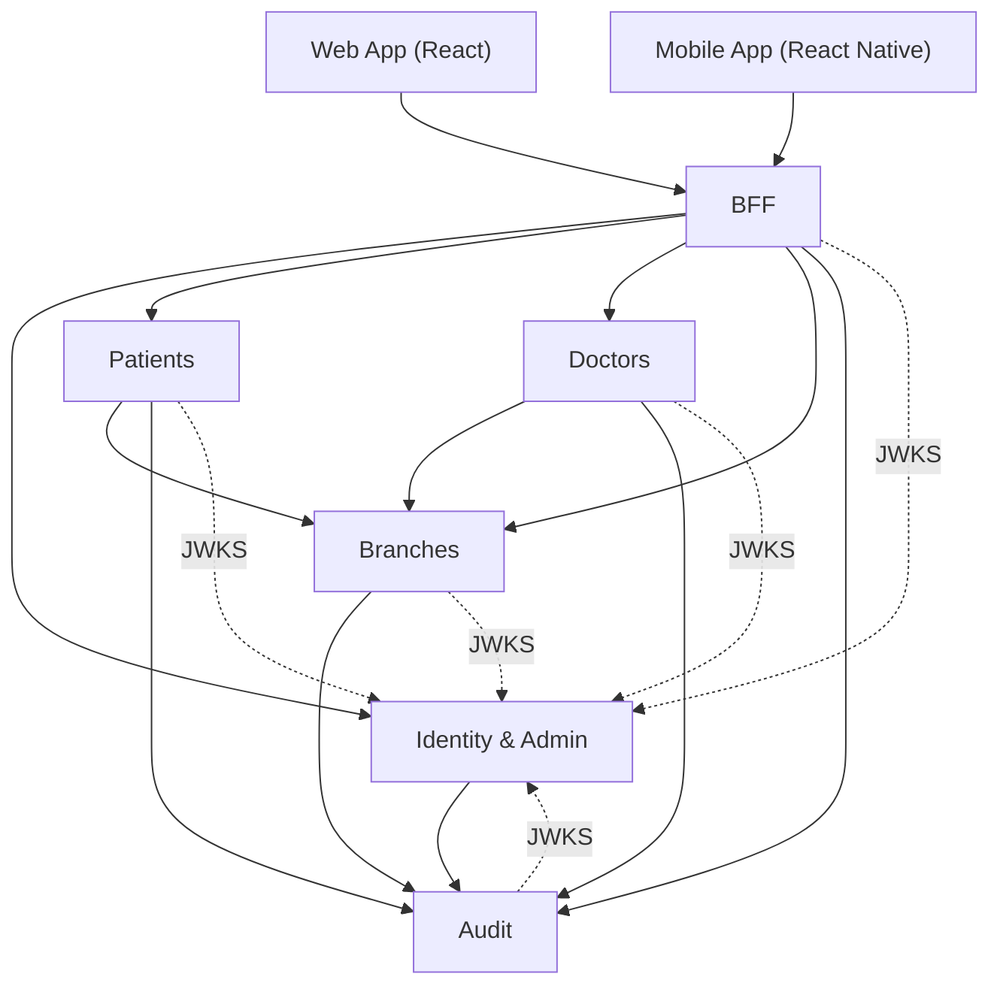

**Reading the graph.** Solid arrows are runtime REST calls; dotted arrows are periodic JWKS key fetches. Two observations carried from the ADRs: (1) **Audit is a downstream dependency of every mutating service** — the coupling accepted in §14, mitigated by the fail-open buffer; (2) **Patients and Doctors depend on Branches** to validate branch IDs at association time. Every hop propagates the W3C `traceparent` header so a single user action is traceable end-to-end (§12.3).

---

## 5. Modular Service Design

Every service follows the same internal layering (a Clean/Onion arrangement), so engineers move between services with zero ramp-up. Dependencies point **inward**; the Domain layer depends on nothing.

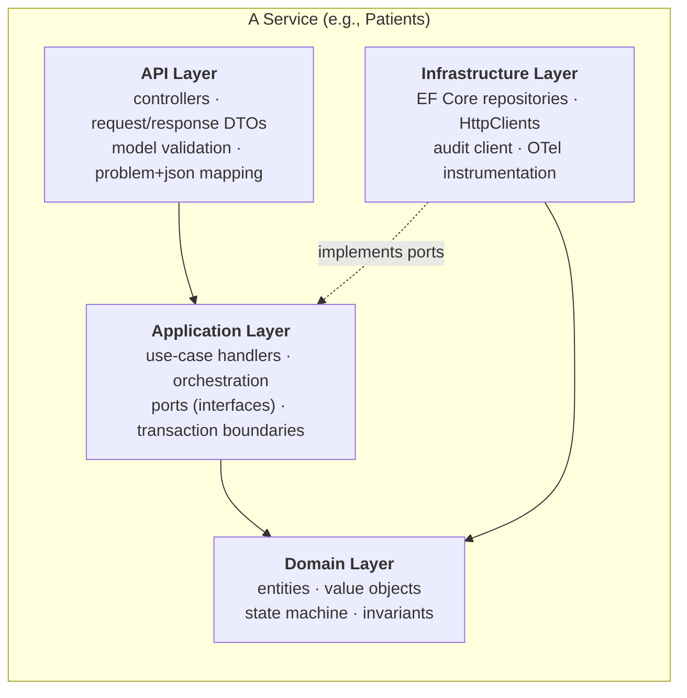

**Standard solution layout (per service):**

```
src/
  NexusHA.<Service>.Api/             # controllers, DTOs, filters, Program.cs
  NexusHA.<Service>.Application/     # handlers, ports, validators
  NexusHA.<Service>.Domain/          # entities, value objects, state machine
  NexusHA.<Service>.Infrastructure/  # EF Core, HttpClients, audit, OTel
tests/
  NexusHA.<Service>.UnitTests/
  NexusHA.<Service>.IntegrationTests/
```

Lifecycle rules (e.g., the doctor state machine) live in the **Domain** layer as explicit, testable transitions — never scattered across controllers.

---

## 6. API Design Standards

These conventions apply uniformly across all services and the BFF.

- **Style & format:** REST over HTTPS; JSON bodies; `camelCase` properties.
- **Versioning:** URL path — `/api/v1/...`. Breaking changes introduce `/api/v2` (ADR-style: additive within a version).
- **Resource naming:** plural nouns (`/patients`, `/doctors`); state changes as sub-resource actions (`POST /patients/{id}/archive`).
- **HTTP semantics:** `GET` (read, safe), `POST` (create / action), `PUT` (full update), `PATCH` (partial), `DELETE` (remove association). Reads are idempotent and retry-safe.
- **Idempotency:** all unsafe writes accept an `Idempotency-Key` header; the server de-duplicates retries (essential because retries are enabled — §12.9).
- **Pagination:** `?page=1&size=20` (1-based; default 20, max 100). Responses include `page`, `size`, `totalCount`.
- **Filtering & sorting:** explicit query params (`?status=Active&branchId=...&sort=createdAtUtc:desc`).
- **Status codes:** `200/201/204` success; `400` malformed; `401` unauthenticated; `403` unauthorized; `404` not found; `409` conflict (e.g., illegal state transition); `422` validation; `429` rate-limited; `503` dependency unavailable.
- **Errors:** always `application/problem+json` per §7.
- **Concurrency:** optimistic, via `RowVersion`/`ETag`; mismatches return `409`.

---

## 7. Error Handling — RFC 9457 Problem Details

All services return errors as **`application/problem+json`** (RFC 9457). ASP.NET Core's `ProblemDetails` pipeline is used, extended with `traceId` and a machine-readable `code`.

**Standard shape:**

```json
{
  "type": "https://errors.nexusha.local/validation",
  "title": "Validation failed",
  "status": 422,
  "code": "PATIENT_VALIDATION",
  "detail": "One or more fields are invalid.",
  "instance": "/api/v1/patients",
  "traceId": "00-1f8b2c3d4e5f60718293a4b5c6d7e8f9-a1b2c3d4e5f60718-01",
  "errors": [
    { "field": "phone", "message": "Phone already registered for role 'patient'." }
  ]
}
```

**Field rules.** `type` is a stable URI from the catalogue (Appendix A); `title` is human-readable and constant per `type`; `status` mirrors the HTTP code; `code` is the machine key; `detail` is instance-specific; `instance` is the request path; `traceId` is the W3C trace id for cross-referencing logs/traces; `errors[]` carries field-level validation problems.

**Common mappings:** illegal lifecycle transition → `409 LIFECYCLE_INVALID_TRANSITION`; duplicate phone+role → `409 DUPLICATE_IDENTITY`; unknown branch on association → `422 BRANCH_UNKNOWN`; downstream dependency open-circuit → `503 DEPENDENCY_UNAVAILABLE`. The full catalogue is Appendix A.

---

## 8. API Contracts (per service)

Representative endpoints with shapes. Every endpoint requires an authenticated admin (§11) unless marked **public**.

### 8.1 Identity & Admin (`identity`)

| Method | Path | Purpose |
|---|---|---|
| POST | `/api/v1/auth/token` | **public** — exchange credentials for tokens |
| POST | `/api/v1/auth/refresh` | **public** — exchange refresh token for new access token |
| POST | `/api/v1/auth/revoke` | revoke a refresh token |
| GET | `/.well-known/jwks.json` | **public** — signing keys for token validation |
| GET/POST/PATCH | `/api/v1/admins` | manage admin accounts |

```jsonc
// POST /api/v1/auth/token  (request)
{ "username": "asha.menon", "password": "••••••••" }
// 200 (response)
{ "accessToken": "eyJ...", "tokenType": "Bearer", "expiresIn": 900, "refreshToken": "eyJ..." }
```

### 8.2 Patients (`patients`)

| Method | Path | Purpose |
|---|---|---|
| POST | `/api/v1/patients` | create (Draft) |
| GET | `/api/v1/patients/{id}` | fetch by GUID or public code |
| GET | `/api/v1/patients?status=&branchId=&page=&size=` | list/search |
| PATCH | `/api/v1/patients/{id}` | partial update |
| POST | `/api/v1/patients/{id}/activate` | Draft → Active |
| POST | `/api/v1/patients/{id}/archive` | Active → Archived (sets `archivedAtUtc`) |
| POST | `/api/v1/patients/{id}/branches` | associate branch(es) |
| DELETE | `/api/v1/patients/{id}/branches/{branchId}` | remove association |

```jsonc
// POST /api/v1/patients  (request)
{ "firstName": "Ravi", "lastName": "Kumar", "phone": "+91-98XXXXXXXX", "dateOfBirth": "1990-04-12", "branchIds": ["..."] }
// 201 (response)  Location: /api/v1/patients/{id}
{ "id": "0a9f...-guid", "publicCode": "PAT-2026-BLR-000012", "status": "Draft", "branchIds": ["..."], "createdAtUtc": "2026-05-27T09:00:00Z" }
```

### 8.3 Doctors (`doctors`)

| Method | Path | Purpose |
|---|---|---|
| POST | `/api/v1/doctors` | create (Pending) |
| GET | `/api/v1/doctors/{id}` · `?status=&branchId=&page=&size=` | fetch / list |
| PATCH | `/api/v1/doctors/{id}` | partial update |
| POST | `/api/v1/doctors/{id}/documents` | upload verification document (multipart) |
| POST | `/api/v1/doctors/{id}/verify` | Pending → Verified |
| POST | `/api/v1/doctors/{id}/approve` | Verified → Approved |
| POST | `/api/v1/doctors/{id}/activate` | Approved → Active |
| POST | `/api/v1/doctors/{id}/deactivate` | Active → Deactivated |
| POST/DELETE | `/api/v1/doctors/{id}/branches[/{branchId}]` | manage branch links |

State-changing endpoints validate the transition in the Domain layer; an illegal transition returns `409 LIFECYCLE_INVALID_TRANSITION`.

### 8.4 Branches (`branches`)

| Method | Path | Purpose |
|---|---|---|
| GET | `/api/v1/branches` · `/{id}` | list / fetch |
| POST | `/api/v1/branches` | create |
| PATCH | `/api/v1/branches/{id}` | update |

### 8.5 Audit (`audit`)

| Method | Path | Purpose |
|---|---|---|
| POST | `/api/v1/audit` | **internal** — ingest an entry (idempotent via `Idempotency-Key`) |
| GET | `/api/v1/audit?entityType=&entityId=&from=&to=&page=&size=` | query history |

### 8.6 BFF (client-facing)

| Method | Path | Purpose |
|---|---|---|
| POST | `/api/v1/session/login` | login; sets secure session/token for the client |
| GET | `/api/v1/patients/{id}` | patient **with branch names resolved** (aggregates Patients + Branches) |
| GET | `/api/v1/doctors/{id}` | doctor with documents + branch names |
| … | … | client-shaped reads/writes proxied to services |

The BFF never exposes internal service URLs to clients; it is the only public surface (§13).

---

## 9. Concrete Database Schema

One database per service on a shared SQL Server host (ADR-003). **No cross-database foreign keys** — references across services (e.g., `BranchId` in `patients`) are validated by the application at write time, not by the database.

**Identifier strategy.** Internal surrogate keys are **sequential `uniqueidentifier`** (GUID; `NEWSEQUENTIALID()` / UUIDv7-style) to avoid index fragmentation. Patients and doctors additionally carry a **human-friendly public code** `PAT|DOC-YYYY-<BRANCH>-NNNNNN`, generated by a concurrency-safe per-branch-per-year counter (table below). The embedded branch is the **issuing branch only** and is *not* the source of truth for branch membership (that is the association table).

### 9.1 `patients` database

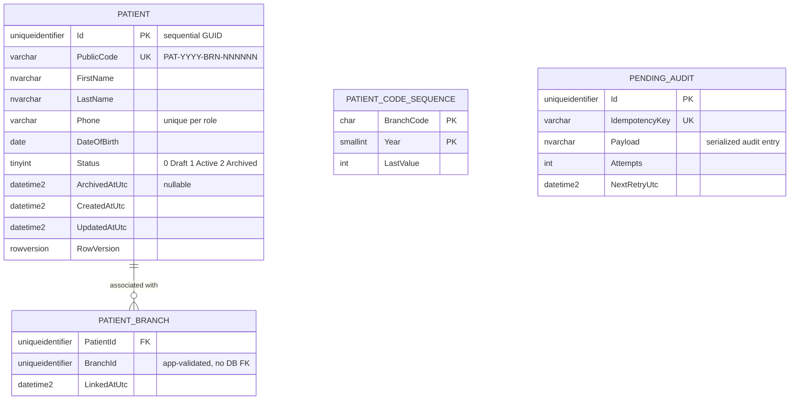

Indexes/constraints: unique `Phone`; unique `PublicCode`; composite PK on `PATIENT_BRANCH (PatientId, BranchId)`; filtered index on `(Status, ArchivedAtUtc)` for the purge job.

### 9.2 `doctors` database

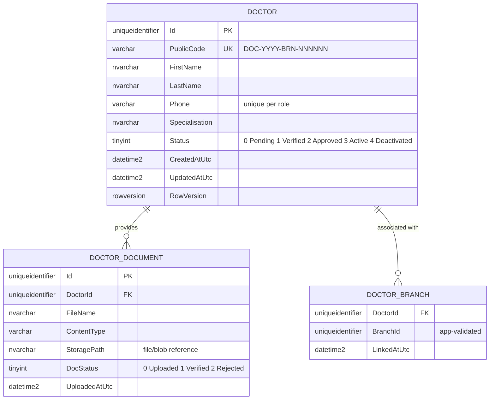

*(A `DOCTOR_CODE_SEQUENCE` and `PENDING_AUDIT` table mirror the patient database.)*

### 9.3 `branches` database

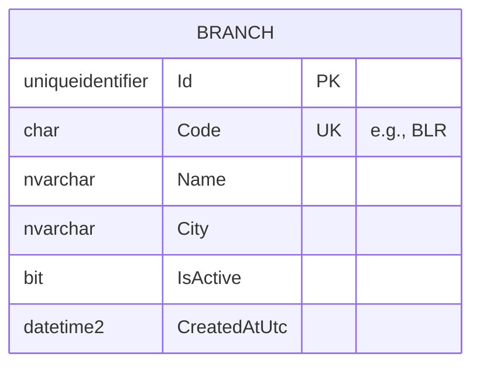

### 9.4 `identity` database

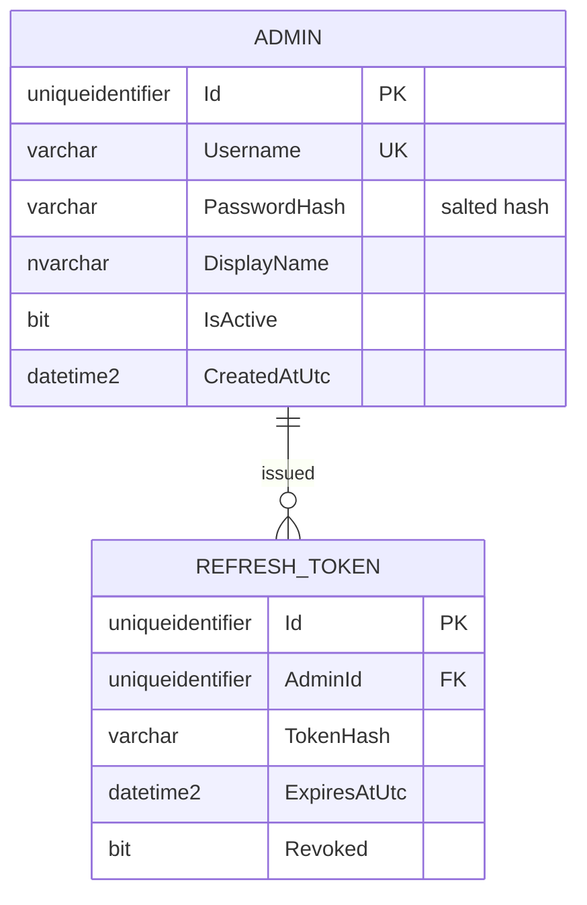

### 9.5 `audit` database

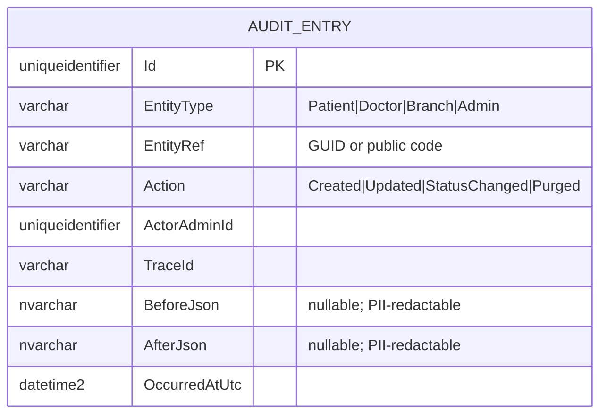

### 9.6 Soft-delete & 30-day purge

Patients are archived by setting `Status = Archived` and `ArchivedAtUtc`. A **daily UTC background job in the Patients service** hard-deletes patients whose `ArchivedAtUtc` is older than 30 days, together with their `PATIENT_BRANCH` rows. To satisfy DPDP minimisation **and** the audit requirement simultaneously, the purge emits a `Purged` audit action and **redacts PII** (`BeforeJson`/`AfterJson`) in that patient's existing audit entries while preserving the audit *events* themselves. The job is idempotent and safe to re-run.

---

## 10. Authentication (AuthN)

Identity is self-hosted (ADR-006). Admins authenticate; **patients and doctors never log in**. Tokens are signed JWTs (RS256) validated locally by each service via JWKS.

**Access-token claims:** `sub` (admin id), `name`, `role` (`Admin`), `iss`, `aud`, `iat`, `exp`, `jti`. Access tokens are short-lived (~15 min); refresh tokens are longer-lived, hashed at rest, and revocable. Signing keys rotate and are published at `/.well-known/jwks.json`.

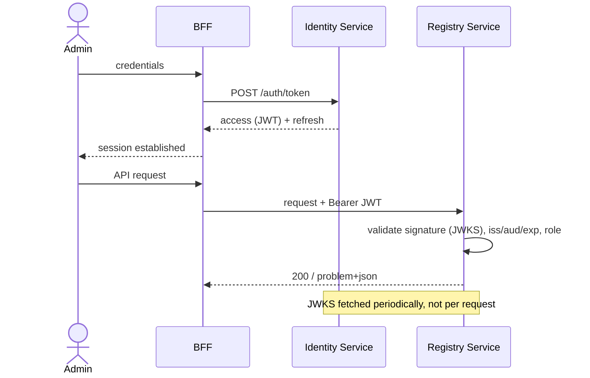

MFA is **not** implemented in this phase (ADR-007); the design leaves a clean insertion point at the Identity service for adding it later.

---

## 11. Authorization (AuthZ)

Authorization is **policy-based**. Today a single policy, `RequireAdmin`, asserts the `role=Admin` claim and guards every non-public endpoint. The model is deliberately structured so finer-grained roles/permissions can be added later by introducing new policies and claims — without touching controllers that already declare their policy. Enforcement happens at the **BFF** (coarse gate) and again at **each service** (defence in depth; services never trust the BFF blindly).

---

## 12. Cross-Cutting Non-Functional Requirements

### 12.1 Logging
Structured JSON via `ILogger`/Serilog, enriched with `trace_id`, `span_id`, service name, and request path. **PII is scrubbed** (no names, phones, DOBs in logs) for DPDP. Logs are exported over **OTLP**.

### 12.2 Metrics
OpenTelemetry Metrics: process/runtime (**CPU, memory, GC, thread/IO**), ASP.NET Core HTTP server metrics (request duration, count, active requests), `HttpClient` metrics (for inter-service calls), and EF Core/SQL metrics. **Host network & IO** are captured at the infrastructure layer (node-level exporter). Exported via **OTLP → Collector → Prometheus**.

### 12.3 Tracing
OpenTelemetry Tracing across ASP.NET Core, `HttpClient`, and EF Core. The **W3C `traceparent`** header propagates across every synchronous REST hop, so one admin action yields a single end-to-end trace spanning BFF → service → Branches/Audit. Exported via **OTLP → Collector → Tempo/Jaeger**.

### 12.4 OTLP pipeline
Logs, metrics, and traces are all OTLP-native and routed through a single Collector, which fans out to backends. Routing through the Collector means backends can change (e.g., to Azure Monitor in the cloud phase) without touching service code.

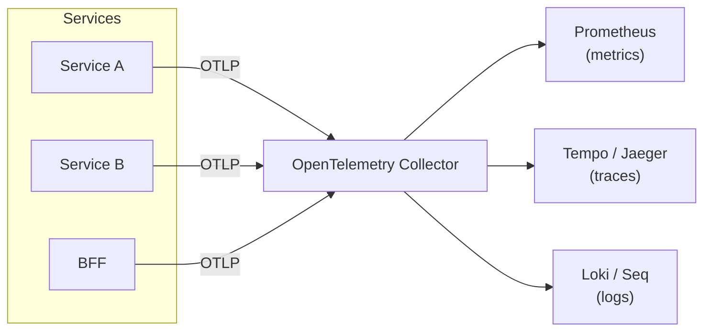

### 12.5 Health checks
Each service exposes `/health/live` (process up) and `/health/ready` (DB reachable + JWKS available). Wired to Docker Compose healthchecks and AKS liveness/readiness probes.

### 12.6 OpenAPI / Swagger
Each service generates an OpenAPI document via `Microsoft.AspNetCore.OpenApi`, with Swagger UI exposed in non-production. The BFF surfaces an aggregated developer view.

### 12.7 CORS
Configured at the BFF only: allow the known web origin(s), required methods/headers, credentials as needed. Internal services are not browser-reachable.

### 12.8 Rate limiting
Built-in ASP.NET Core rate-limiting middleware: **IP-based, 100 requests/minute**. Implementation corrections (from review): (1) real client IP is read from `Forwarded`/`X-Forwarded-For` via `ForwardedHeaders`, trusting only the known BFF/ingress; (2) an edge IP backstop at the BFF plus a **per-authenticated-user** limit keyed on `sub` (fairer, since admins may share one hospital egress IP); (3) **internal service-to-service traffic is exempt** (separate policy / network), so inter-service calls are never throttled. Throttled requests return `429` with `problem+json` and `Retry-After`.

### 12.9 Resilience (inter-service)
All outbound `HttpClient`s use `Microsoft.Extensions.Http.Resilience` (Polly v8) standard handler:

| Policy | Default |
|---|---|
| Timeout | 5 s per attempt |
| Retry | up to 3 attempts, exponential backoff (base 200 ms) + jitter; **idempotent calls only** |
| Circuit breaker | open at ≥50% failures over a 10 s sampling window (min 20 calls), break 30 s |
| Concurrency / bulkhead | cap concurrent calls per dependency (e.g., 100) to isolate a slow downstream |

Retries are only applied to reads and to writes carrying an `Idempotency-Key`, preventing duplicate side-effects.

### 12.10 Configuration & secrets
Configuration via environment variables/`appsettings` per environment. Secrets from an on-prem secret store now, migrating to **Azure Key Vault** in the cloud phase.

---

## 13. BFF Design

A **single shared BFF** serves both web and mobile (a conscious simplification — see risk #3). Responsibilities: terminate client auth/session, enforce CORS and the edge rate-limit backstop, **aggregate** across services (e.g., resolve branch names onto a patient), shape responses for clients, and call services through resilient `HttpClient`s. It holds no domain database.

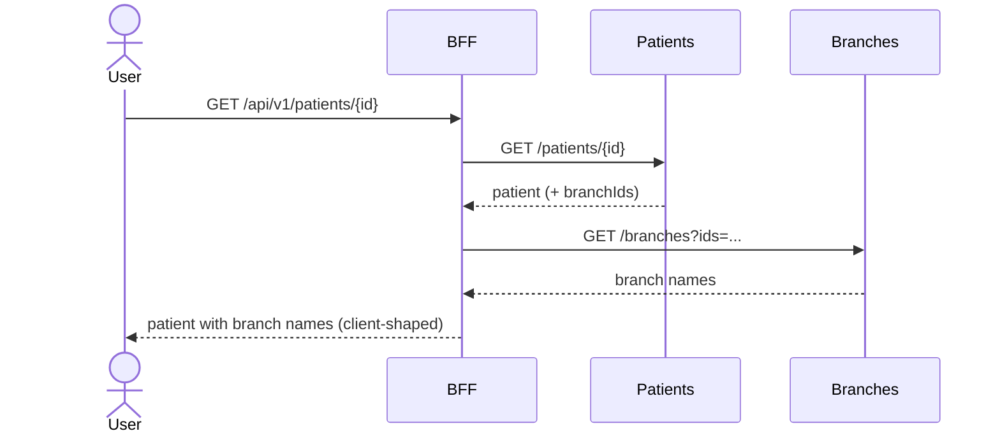

**Watch-points (documented):** the shared BFF tends to accumulate client-specific branching and is a single edge chokepoint — mitigated by running multiple replicas under AKS and by the option to split into Web-BFF / Mobile-BFF later if the clients diverge.

---

## 14. Audit Subsystem Design

Audit writes are **synchronous** with a **fail-open** policy plus a **durable local pending buffer** (your decision). The business write is never blocked; if the synchronous call to the Audit service fails, the audit intent is persisted locally (`PENDING_AUDIT`) and a background reconciler retries it (idempotently, via `Idempotency-Key`) until it lands. This delivers availability now and a complete trail eventually — never a silent loss.

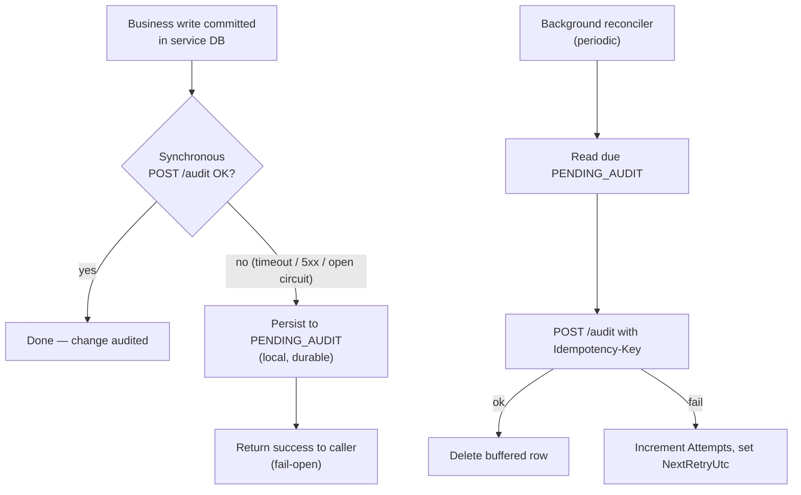

**Audit entry** captures `EntityType`, `EntityRef`, `Action`, `ActorAdminId`, `TraceId`, optional `BeforeJson`/`AfterJson`, and `OccurredAtUtc` (§9.5). On patient purge, PII inside referenced entries is redacted while the audit event is preserved.

---

## 15. Key Workflow Sequences

### 15.1 Doctor verification → approval → activation

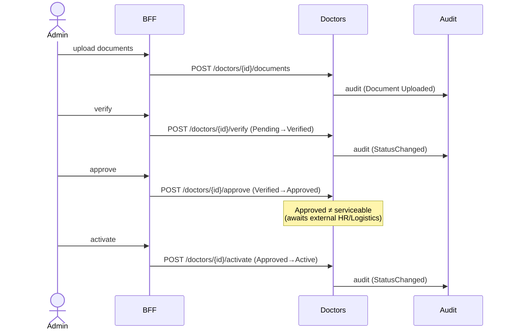

### 15.2 Patient archive → 30-day purge

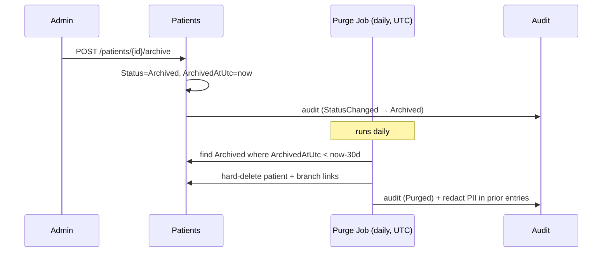

---

## 16. Coding Standards & Conventions

All services follow Microsoft's official guidance, applied uniformly so the codebase reads as if written by one author. Where this section is silent, that guidance governs:

- **C# coding conventions** — <https://learn.microsoft.com/dotnet/csharp/fundamentals/coding-style/coding-conventions>
- **Framework Design / naming guidelines** — <https://learn.microsoft.com/dotnet/standard/design-guidelines/>

### 16.1 Naming

| Element | Convention | Example |
|---|---|---|
| Namespaces, types, methods, properties | PascalCase | `PatientService`, `Activate()` |
| Interfaces | `I` + PascalCase | `IPatientRepository` |
| Local variables, parameters | camelCase | `patientId` |
| Private / internal fields | `_camelCase` | `_dbContext` |
| Constants, `static readonly` | PascalCase | `MaxPageSize` |
| Async methods | PascalCase + `Async` | `GetByIdAsync` |
| Type parameters | `T` + PascalCase | `TEntity` |
| Boolean members | affirmative `Is/Has/Can` | `IsActive` |

### 16.2 Language & style

- **File-scoped namespaces**; one top-level type per file; filename equals type name.
- **Nullable reference types enabled** solution-wide; the null-forgiving `!` operator only with a justifying comment.
- `using` directives outside the namespace, `System.*` first then alphabetical; unused usings removed (analyzer-enforced).
- Prefer `var` when the type is obvious from the right-hand side; explicit types otherwise.
- Use target-typed `new()`, pattern matching, and expression-bodied members where they aid clarity. **Always use braces**, even for single statements.
- `record` types for immutable DTOs and value objects; `class` for entities and services.

### 16.3 Asynchronous code

- Async all the way down for I/O; **no `async void`** (bar event handlers); never block via `.Result` / `.Wait()`.
- Flow `CancellationToken` from controller → handler → EF Core / `HttpClient`.
- Return `Task` / `ValueTask`; always suffix `Async`.

### 16.4 Layering discipline (per §5)

- **API layer** — thin controllers: bind, validate, delegate to an Application handler, map to `IActionResult` / `ProblemDetails`. No business logic, no EF Core.
- **Application layer** — use-case handlers and **ports** (interfaces); owns transaction boundaries; depends only on Domain.
- **Domain layer** — entities, value objects, and the lifecycle **state machines** with their invariants; depends on nothing; free of EF / HTTP attributes.
- **Infrastructure layer** — EF Core repositories, typed `HttpClient`s, audit client, OTel; implements Application ports. Reads use `AsNoTracking()`; lazy loading disabled.

### 16.5 Validation, errors & dependency injection

- Validate input at the edge (DataAnnotations / FluentValidation); business-rule violations raise domain exceptions mapped centrally to **RFC 9457 `ProblemDetails`** (§7) — controllers never hand-build error bodies.
- **Constructor injection only**; register dependencies at the composition root; no service locator, no mutable `static` state.
- Every cross-service call uses an `IHttpClientFactory` typed client with the resilience handler (§12.9).

### 16.6 Logging & security

- Structured logging via `ILogger`, `LoggerMessage` source generators on hot paths; **never log PII** (§12.1).
- No secrets in source or `appsettings`; resolve from the secret store / Key Vault (§12.10). All persistence is parameterised through EF Core.

### 16.7 Testing

- **xUnit**, Arrange-Act-Assert, test names `Method_Scenario_ExpectedResult`.
- Domain state-machine and uniqueness/validation rules require unit tests; each service ships integration tests against a real SQL Server (Testcontainers) covering its endpoints.

### 16.8 Enforcement (not optional)

- A single root **`.editorconfig`** encodes these rules; Roslyn analyzers and .NET code-style are enabled with **`TreatWarningsAsErrors=true`** and nullable warnings as errors.
- `dotnet format` runs in pre-commit and CI; builds fail on style/analyzer violations.
- **Central Package Management** (`Directory.Packages.props`) pins package versions across all services.
- Public APIs carry XML doc comments, which feed the OpenAPI descriptions (§12.6).

---

## 17. Requirements Traceability (BRD ↔ Implementation)

This matrix confirms that **every BRD requirement is realised** somewhere concrete in this LLD. Where a requirement is met by a non-endpoint mechanism — a validation rule, a background job, or a cross-cutting subsystem — that is stated explicitly, so coverage is verifiable at review.

### 17.1 Functional requirements (BRD §5, §7)

| BRD ref | Requirement | Fulfilled by | LLD § |
|---|---|---|---|
| 5.1 | Only admins create records; no self-registration | All create endpoints guarded by `RequireAdmin`; no public create route exists | §11, §8.2, §8.3 |
| 5.1 | Full lifecycle (create / update / deactivate-archive), both entities | Patients `POST` · `PATCH` · `/activate` · `/archive`; Doctors `POST` · `PATCH` · `/verify` · `/approve` · `/activate` · `/deactivate` | §8.2, §8.3 |
| 5.1 / 7 | Distinct, richer field sets per entity | Separate `PATIENT` and `DOCTOR` schemas | §9.1, §9.2 |
| 5.1 | Associable with one or more branches (many-to-many) | `POST`/`DELETE /{id}/branches`; `PATIENT_BRANCH` / `DOCTOR_BRANCH` join tables | §8.2, §8.3, §9.1, §9.2 |
| 5.2 | System-generated unique identifier for every person | Sequential-GUID `Id` + human-friendly `PublicCode` (mechanism) | §9 |
| 5.2 | Recognise a person by phone + role | Unique `Phone` index within each role's own database (role = owning service) | §9.1, §9.2, §9.4 |
| 5.2 | Same phone once per role; same-role duplicate rejected | Create-time uniqueness check → `409 DUPLICATE_IDENTITY` (validation rule) | §7, §8, §9 |
| 5.3 | Upload supporting documents for doctors | `POST /doctors/{id}/documents`; `DOCTOR_DOCUMENT` table | §8.3, §9.2 |
| 5.3 | Verification by manual admin review | `POST /doctors/{id}/verify` (admin-only action) | §8.3, §15.1 |
| 5.3 | Doctor serviceable only once Active | Domain state machine; `Approved` ≠ serviceable; explicit `/activate` | §8.3, §15.1 |
| 5.4 | Full audit trail (who / what / when) for create, edit, status change | Audit subsystem; every mutating service records to Audit; `AUDIT_ENTRY` (subsystem) | §14, §8.5, §9.5 |

### 17.2 Lifecycle / state models (BRD §6)

| BRD ref | Requirement | Fulfilled by | LLD § |
|---|---|---|---|
| 6.1 | Patient: Draft → Active → Archived | `Status` enum + `/activate` · `/archive`; domain transitions | §8.2, §9.1, §9.6 |
| 6.2 | Doctor: Pending → Verified → Approved → Active → Deactivated | `Status` enum + verify/approve/activate/deactivate; domain state machine | §8.3, §5, §15.1 |

### 17.3 Non-functional & compliance (BRD §4, §8, §10)

| BRD ref | Requirement | Fulfilled by | LLD § |
|---|---|---|---|
| 8.1 | API-first; web & mobile as later consumers | REST APIs per service + single BFF; clients out of scope this phase | §3, §6, §13 |
| 8.1 | Single hospital, multiple branches; no multi-tenancy | `Branches` service + `BRANCH` table; no tenant dimension in any schema | §3, §9.3 |
| 4 / 8.3 | Authentication for administrators only | Self-hosted identity, JWT; patients/doctors never log in | §10 |
| 8.3 | DPDP — access restricted to authorised admins | `RequireAdmin` AuthZ; PII scrubbed from logs | §11, §12.1 |
| 8.3 | Archived patients purged after 30-day retention | Daily UTC purge job + PII redaction in audit (background job) | §9.6, §15.2 |
| 10 | Doctor-document retention policy | **Open item** — carried forward, not yet specified | §19 |

*No BRD requirement is left unmapped. Items realised by a mechanism rather than a callable endpoint (uniqueness validation, the audit subsystem, the purge job, the identifier scheme) are labelled as such above.*

---

## 18. Known Limitations, Trade-offs & Risks (LLD-level)

| # | Area | Consequence | Status / Mitigation | ADR |
|---|---|---|---|---|
| 1 | Synchronous REST | Temporal coupling; a slow/down dependency can cascade. | **Accepted** — contained by timeouts, circuit breaker, bulkhead, idempotent retries (§12.9). | ADR-001 |
| 2 | Audit coupling + dual-write | Audit is on every mutation path; business + audit writes aren't atomic. | **Accepted (fail-open)** — durable pending buffer + idempotent reconciler (§14); no silent loss, eventual completeness. | ADR-001 |
| 3 | Shared BFF | Client-specific branching accumulates; single edge chokepoint. | **Accepted** — multiple replicas; split per-client later if needed (§13). | — |
| 4 | IP rate limiting | Shared egress IP can lump admins together; per-service limiting can throttle internal calls. | **Mitigated** — real client IP, per-user policy, internal exemption (§12.8). | — |
| 5 | Cross-service refs | No DB-level FK between `patients`/`doctors` and `branches`. | **Accepted** — app-level validation against Branches at write time. | ADR-003 |
| 6 | No MFA | Privileged access without a second factor. | **Accepted** for this phase; clean insertion point retained. | ADR-007 |

---

## 19. Assumptions & Open Items

- Document binary storage location for doctor verification files (local volume now; blob storage in the cloud phase) and its retention policy remain the BRD's open item.
- The numeric width of public codes is fixed at 6 digits (≤ 999,999 per branch/year), comfortably above the medium volume.
- Whether an Archived patient may be reactivated within the 30-day window is to be confirmed; the purge job skips any record no longer in `Archived`.
- Token lifetimes (15 min access / refresh window) are starting values, tunable in configuration.

---

## 20. Appendices

### Appendix A — Error catalogue (selected)

| `type` (suffix) | `code` | HTTP | Meaning |
|---|---|---|---|
| `/validation` | `*_VALIDATION` | 422 | Field-level validation failed. |
| `/duplicate-identity` | `DUPLICATE_IDENTITY` | 409 | Same phone + role already exists. |
| `/lifecycle` | `LIFECYCLE_INVALID_TRANSITION` | 409 | Illegal state transition. |
| `/branch-unknown` | `BRANCH_UNKNOWN` | 422 | Referenced branch does not exist. |
| `/not-found` | `NOT_FOUND` | 404 | Resource not found. |
| `/unauthorized` | `UNAUTHORIZED` | 403 | Authenticated but not permitted. |
| `/rate-limited` | `RATE_LIMITED` | 429 | Too many requests. |
| `/dependency-unavailable` | `DEPENDENCY_UNAVAILABLE` | 503 | Downstream open-circuit/unreachable. |

### Appendix B — Glossary delta (new in the LLD)

| Term | Meaning |
|---|---|
| **BFF (Backend-for-Frontend)** | An edge service tailored to client apps that aggregates and shapes calls to back-end services. |
| **Problem Details (RFC 9457)** | Standard JSON error format (`application/problem+json`). |
| **Idempotency key** | A client-supplied key letting the server safely de-duplicate retried writes. |
| **Circuit breaker** | A resilience pattern that stops calling a failing dependency for a cool-down period. |
| **Bulkhead** | Limiting concurrent calls to a dependency so one slow dependency can't exhaust resources. |
| **OTLP** | OpenTelemetry Protocol — the wire format for logs, metrics, and traces. |
| **JWKS** | JSON Web Key Set — the public keys used to validate signed JWTs. |
| **Transactional outbox / pending buffer** | A durable local record of an intended side-effect, retried until it succeeds. |

---

*Confidential — Draft v0.1 — Nexus HA Low-Level Technical Specification*
